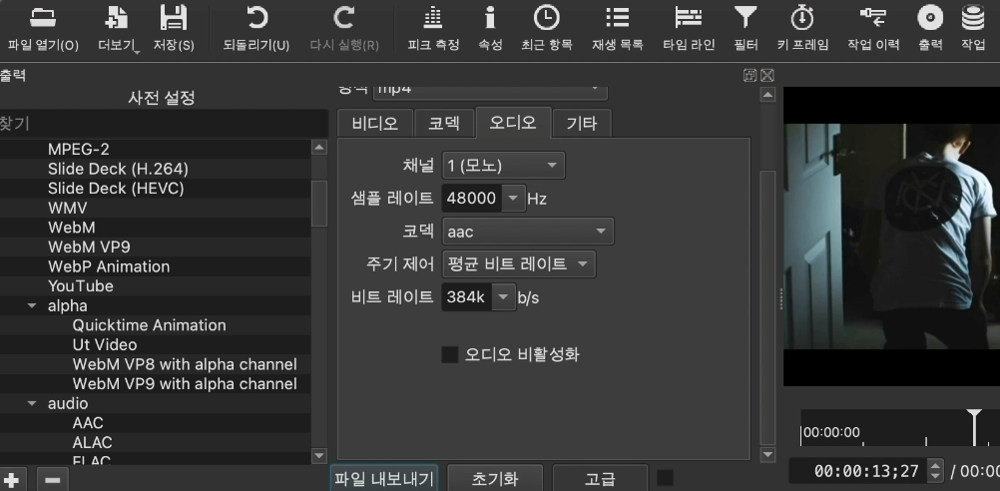

오픈소스 소프트웨어 기말 프로젝트 보고서
=======================================

*이름 : 김태석*

*학번 : 201721083*

*학과 : 미디어학과*

# 목차

1. 주제
1. 주제선정이유
1. 강의내용
	- 샷컷 설치 및 파일 불러오기
	- 동영상 길이 조절 및 영상 자르기
	- 오디오 불러오기 및 오디오 자르기, 볼륨조절
	- 자막넣기
	- Fade in, Fade out 등 동영상 효과넣기
	- 영상 내보내기
1. Shotcut의 장점 및 단점
1. 참고

## 1. 주제
shotcut 설치법 및 사용법 강의

## 2. 주제 선정 이유
최근 현대 사회는 넷플릭스, 디지니 플러스, 유튜브 등 OTT서비스의 발달로 동영상 매체에 대한 접근이 용이해지고 있다.
이 중 특히 유튜브는 자신의 채널을 생성하고 원하는 콘텐츠를 영상으로 제작하여 직접 게시할 수 있다는 차별성을 갖고 있는데, 콘텐츠를 촬영하고 이를 게시하기 위한 영상 편집을 위하여 다양한 툴을 사용하고 있는 상황이다.
사용되고 있는 툴 중 가장 대표적인 프로그램은 어도비 프리미어 프로이지만, 오픈소스 프로그램이 아니고 사용법이 상당히 까다롭다는 단점이 존재하여 이는 간단히 영상을 편집하고 게시하는 사람들에겐 하나의 진입장벽이 될 수 있다고 생각한다.
때문에 a free, open source, cross-platform video editor인 shotcut에 대한 사용 강의를 제작하여 영상 편집에 입문하는 유저들에게 도움이 되고자 이 주제를 선정하게 되었다.

## 3. 강의내용
### (1) 샷컷 설치 및 파일 불러오기
- 운영체제에 따른 샷컷 설치 방법

설치는[Shotcut Download](https://shotcut.org/download/)에서 가능하다.

윈도우의 경우 exe 파일을 내려받아 샷컷을 설치 할 수 있다. 맥OS 사용자의 경우 dmg파일을 다운받아 설치 할 수 있다.

- Shotcut Git repository에서 readme.md 및 Copying 파일 흝어보기

샷컷은 오픈소스 프로그램이기 때문에 깃 저장소에 그 소스들일 공개되어 있다.
readme.md 파일에는 shotcut 소개와 함께 설치법, 빌드 방법 및 번역에 대한 정보가 적혀있다.
Copying파일에서는 shotcut이 따르고 있는 license에 대한 정보가 나와 있다. 
shotcut을 사용하면 GPL 라이센스를 따르기 때문에 상업적 이용은 가능하지만, 소스코드의 공개가 필요하고 동일한 GPL license의 적용을 받는다.
- 새로운 프로젝트 생성 및 동영상 추가

샷컷을 처음 실행시키면 위와 같은 부분이 보일 것이다. 프로젝트 이름을 작성하고 시작을 눌러주면 프로젝트가 생성된다. 

동영상은 그림에서 보이는 파일열기를 클릭한 후 원하는 소스를 추가한 뒤 +버튼을 눌러 불러올 수 있다.
그 후 원하는 소스를 타임라인에 드래그하여 타임라인을 생성한다.

### (2) 동영상 길이 조절 및 영상 자르기
- 읽어온 동영상의 길이 조절하기

타임라인에 표시된 영상클립의 시작 혹은 끝부분을 클릭 후 드래그하면 원하는 만큼 영상의 길이를 조절 할 수 있다.

- 읽어온 영상을 원하는 위치에서 자르기

혹여 마우스로 미세한 조정이 어려울 경우 원하는 위치에 헤더를 위치한 후 s키를 누르면 영상이 잘리게 되고 이후 불필요한 부분을 delete키 혹은 backspace키를 이용하여 삭제해 주면 된다. (맥북은 s키가 영문입력 상태에서만 작동한다. windows는 확인하지 못하였다.)

### (3) 오디오 불러오기 및 오디오 자르기, 볼륨 조절하기

- 영상에서 오디오 분리하기

오디오를 불러오는 방법과 자르기 방법은 영상에서의 방법과 동일하므로 생략하도록 하겠다. 대신 영상 소스와 오디오가 합쳐져 있는 경우 이를 분리하는 방법을 설명하도록 하겠다.
오디오 분리를 원하는 타임라인 내의 소스를 우클릭한 후 더보기->오디오 분리 를 클릭 해 주면 비디오 타임라인과 오디오 타밍라인으로 소스가 분리되는 것을 확인 할 수 있다.

- 오디오의 볼륨 조절하기

오디오의 볼륨을 줄이기 위해선 필터 기능을 사용하여야 한다. 이 필터는 후에 동영상 효과넣기, 자막넣기에서도 사용된다.

오디오 조절을 원하는 타임라인 내의 오디오 소스를 클릭한 후 위의 화면에서 보이는 필터 -> 오디오 -> 게인/음량을 클릭한 후 레벨(데시벨)을 조절 해 주면 오디오의 음량을 크고 작게 조절할 수 있다.

### (4) 자막넣기

- 영상에 텍스트를 삽입하기

자막을 넣는 방법 중 트랙을 추가하고 텍스트를 추가하여 비디오 트랙에 덮어씌우는 방식이 있지만, 보다 편리한 필터를 이용한 자막 넣기에 대하여 설명하도록 하겠다.

자막을 넣기 위해선 이전 오디오 볼륨조절에서 사용했던 필터의 기능을 사용하여야 한다. 과정은 필터 -> 비디오 ->텍스트 단순 이다. 찾기가 어렵다면 위의 그림에서 보이는 검색란에 텍스트를 입력하여 찾아도 무방하다. 검색 결과 텍스트 단순과 텍스트 서식으로 나뉘게 되는데 텍스트 단순은 글꼴, 글자색을 설정할 수 있다. 이 둘은 자신이 사용하기 편리한 것을 골라 사용하여도 무방하다.

글자를 입력 할 경우 크기조절 및 위치 조절은 미리보기 화면과 필터 창 내에서 모두 가능하다.
밋밋하게 자막이 나오는 것이 싫다면 필터 창 내의 사전설정을 클릭하여 효과를 추가할 수 있다. 

### (5) Fade in, Fade out 및 동영상 효과 넣기

- 영상을 겹치면 나타나는 효과

타임라인에서 나누어져 있는 두 비디오 소스를 겹친다면 기본적으로 디졸브 효과가 나타난다.

디졸브 효과란 앞에 오는 영상은 서서히 fade out 되고 뒤에 오는 영상은 서서히 fade in 되면서 화면이 전환되는 효과이다.

- Fade in, Fade out 효과 넣기 및 조절

fade in, fade out 효과는 앞서 설명한 필터의 기능을 이용하면 가능하다. 필터 -> 비디오 -> 페이드 인 혹은 페이드 아웃 을 클릭하면 위의 그림과 같이 타임라인 내 영상 소스에 적용이 된 모습을 볼 수 있다. 이 때 효과의 길이가 너무 짧거나 길 경우 효과가 나타나는 시간도 설정할 수 있는데 위 그림의 마우스커서의 위치 (즉 fade in 효과가 끝나는 부분)에 마우스를 가져다 대면 커서의 모양이 바뀌면서 이를 클릭하고 원하는 위치까지 드래그하여 조절한다면 효과가 나타나는 범위를 손쉽게 설정 가능하다.

- fade in, fade out 이외의 동영상 효과

필터에는 다양한 동영상 효과들이 존재한다. 이 중 하나를 예를 들면 스케치 효과이다. 효과를 넣을 비디오를 선택한 후 필터 -> 비디오 -> 원하는 효과 클릭 을 통해 다양한 비디오 효과들을 삽입할 수 있다. 비디오 효과를 넣는 것에서 끝나는 것이 아니라 필터 창 내의 다양한 옵션을 이용하여 효과의 정도 또한 결정 가능하다.

### (6) 영상 내보내기

- 미리보기는 영상이 아니다.

shotcut 내의 미리보기를 통해 편집한 결과물을 볼 수 있다. 하지만 이를 영상이라고 칭할 수 없다.

영상 편집 툴 내에서 제공하는 미리보기는 프로그램을 사용하며 편집해온 소스코드 (메타 데이터) 의 흔적들을 잠시 보여주는 것일 뿐이다.

이를 완전히 영상으로 만들기 위해선 인코딩이라는 과정이 필요하다.

- 영상 코덱과 확장자에 대한 이해

영상은 텍스트 및 사진 등 다른 것들에 비하여 용량이 꽤 큰 편이다. 때문에 인코딩을 거치는데, 코덱이란 비디오와 오디오를 압축시키는 역할이며 압축된 비디오와 오디오를 하나로 묶어주는 것이 포맷(확장자)이라고 할 수 있다.

가장 대표적인 코덱들은 H.264, H.265, DivX 등이 있다. 가장 대중적으로 사용되는 코덱은 H.264 이지만 각 코덱마다 장단점이 다르니 원하는 코덱을 설정하여 내보내기를 진행하면 된다. 

가장 대표적인 포맷들은 AVI, MOV, MP4, FLV, MPEG-4, MKV 등이 있다. AVI는 윈도우에서 가장 흔히 쓰이던 포맷이고, MOV는 맥OS에서 가장 흔히 쓰이던 포맷이다. 요즘 가장 대중적으로 사용되는 포맷은 고압축의 비디오, 오디오 코덱을 사용하며 용량이 상대적으로 작은 MPEG에서 출시한 MP4 포맷이다.

- 오디오 채널에 대한 이해

오디오 채널은 크게 세가지로 나뉜다. 바로 모노, 스테레오 그리고 5.1채널이다.

모노는 음원이 하나이다. 때문에 스피커의 개수와 상관없이 모든 스피커에서 동일한 소리를 발생한다.

스테레오는 음원이 2개이다. 정상적인 스테레오 음원을 재생하기 위해선 2개의 스피커가 필요하다. 좌 우 소리의 균형이 맞게 출력되긴 하지만 자세히 들어보면 미묘한 차이를 느낄 수 있다. 덕분에 모노보다 더욱 풍성한 소리를 표현 가능하다.

5.1채널은 총 5개의 스피커와 1개의 우퍼로 구성된다. 우퍼의 경우 저음역을 강화시켜주는 역할을 하기에 0.1로 취급한다. 5개의 스피커는 그림과 같이 center, front left, front right, rear left, rear right로 구성되어 있다. (서브 우퍼는 center 옆에 위치한다.) 총 6개의 장치를 사용하기 때문에 당연히 스테레오 보다 소리의 입체감을 좋게 표현할 수 있다. 이 덕분에 공간감이 느껴져 홈 시어터 등에 사용된다.

이외에도 7.1 채널과 같이 left back, right back을 사용하는 채널이 있지만 shotcut의 오디오 내보내기 옵션에는 언급한 3가지 채널만 존재하므로 추가적인 설명은 생략하도록 하겠다.

샷컷에서 영상을 내보내는 방법은 위 그림 오른쪽 상단 부분에 있는 출력을 클릭하고 포맷을 선택한 후 비디오, 코덱 오디오 에서 원하는 설정값을 입력 후 파일 내보내기를 눌러주면 된다. 일반적으로는 H.264 코덱을 사용하여 MP4 포맷으로 파일을 생성한다. 자세히 알지 못할 경우 원하는 코덱만 선택하더라도 디폴트값으로 알맞게 값들이 설정되기 때문에 따로 수정하지 않아도 괜찮다.

## 4. Shotcut의 장단점

장점 : 무료로 NLE 사용이 가능하다. NLE이란 논 리니어 편집 시스템의 약자로 비디오 클립 안의 원하는 프레임에 쉽게 접급 및 재배열 할 수 있는 편집 방식이다. 또한 인터페이스가 매우 직관적으로 구성되어 있어 영상 편집을 처음으로 시작하는 사람들이 편집에 대해 이해하고 다양한 기능에 접근하는데에 어려움이 적다.
게다가 한국어 번역이 100퍼센트 완료되어 있어서 영어를 못하더라도 프로그램을 처음 사용하는데 지장이 없다.

단점 : 최적화가 좋지 못하다. 다양한 기능을 제공하지만 편의를 제공하지는 못하는 것 같다. 

## 5. 참고
[Shotcut Download](https://shotcut.org/download/)

[Shotcut Git Repository](https://github.com/mltframework/shotcut)

[How to Use Shotcut](https://shotcut.org/tutorials/)

[difference of audio channel](https://yespickbible.tistory.com/entry/%EC%86%8C%EB%A6%AC%EC%97%90%EC%84%9C-%EB%AA%A8%EB%85%B8%EC%99%80-%EC%8A%A4%ED%85%8C%EB%A0%88%EC%98%A4%EC%9D%98-%EC%B0%A8%EC%9D%B4)

[About codec and format](https://m.blog.naver.com/PostView.naver?isHttpsRedirect=true&blogId=signcast&logNo=221494839692)
